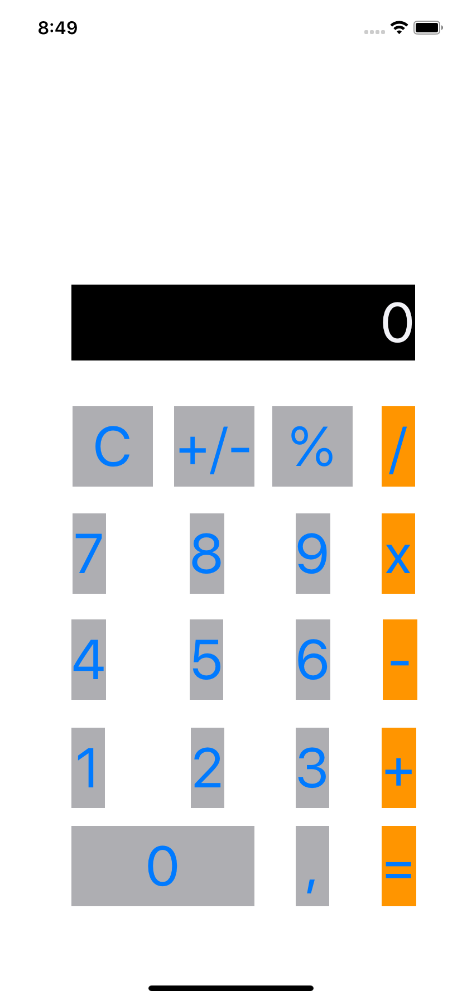

# calc-iOS-group6

Essa é uma calculadora para iOS mobile, que eu e meu Grupo 6 aprendemos com a Digital House.

A atividade consiste em um Coding Dojo, realizado em 30 de agosto de 2020.

Alguns requisitos para a calculadora foram exigidos na atividade:

- A calculadora deve conter: 10 botões numéricos (de 0 a 9), um campo de texto exibindo as operações, e pelo menos 5 botões de ação com operadores matemáticos (/, +, -, x e =) ;

- Utilizar como inspiração o layout da calculadora da Apple ;

- Todos os botões devem ter fundo colorido ;

- Desafio extra: deixar os botões arredondados.

---

O layout da nossa calculadora final é mostrado na figura a seguir:

<table>
  <tr>
    <th>
      
    </th>
  </tr>
</table>

Essa é a versão que obtivemos logo após o término da aula. Todos os botões estão funcionando (exceto o % e o +/-), e a calculadora trabalha apenas com números inteiros, não sendo possível aplicar números decimais com a vírgula.

Após a aula, o Grupo avançou nos pontos mais estéticos e fez uma calculadora muito semelhante à da Apple, cumprindo todos os requisitos. Futuramente, a versão publicada aqui será atualizada para essa calculadora final.

Em caso de dúvidas, favor encaminhar um e-mail para: rap.oliveira@usp.br
